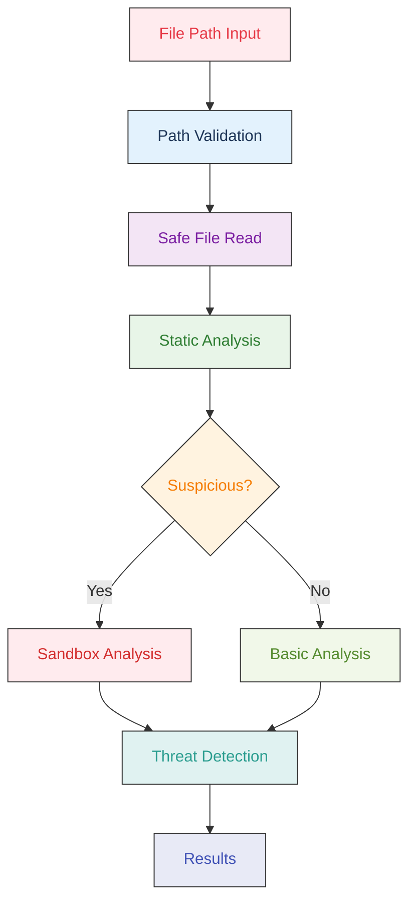

# NullVoid

[](https://www.npmjs.com/package/nullvoid)
[](https://www.npmjs.com/package/nullvoid)
[](https://opensource.org/licenses/MIT)
[](https://github.com/kurt-grung/NullVoid/stargazers)
[](https://github.com/kurt-grung/NullVoid/actions)

**Ø NullVoid** - Detect malicious code.

Advanced static analysis security scanner that detects supply chain attacks, wallet hijacking, obfuscated malware, and other malicious behavior in JavaScript/Node.js projects, npm packages, and codebases. Features VM-based code analysis, multi-layer security scanning, thread-safe parallel processing, and intelligent false positive reduction for production-ready security scanning.

## 📋 Scan Commands

### Scan 
```bash
# Scan current directory and subdirectories
nullvoid

# Scan a specific package
nullvoid express

# Scan a specific directory
nullvoid /path/to/project
```

### **GitHub CI Actions Integration**
```yaml
# .github/workflows/security.yml
name: Security Scan
on: [push, pull_request]

jobs:
  security-scan:
    runs-on: ubuntu-latest
    steps:
      - uses: actions/checkout@v3
      - name: Setup Node.js
        uses: actions/setup-node@v3
        with:
          node-version: '18'
      
      - name: Install NullVoid
        run: npm install -g nullvoid
      
      - name: Run Security Scan
        run: nullvoid . --output sarif --sarif-file nullvoid-results.sarif
      
      - name: Upload SARIF Results
        uses: github/codeql-action/upload-sarif@v2
        with:
          sarif_file: nullvoid-results.sarif
```


### Scan Options
```bash
# Show all threats (including low/medium severity)
nullvoid --all
# or
nullvoid . --all

# Verbose output with more details
nullvoid --verbose
# or
nullvoid . --verbose

# Limit dependency depth
nullvoid --depth 2
# or
nullvoid . --depth 2

# Enable parallel processing
nullvoid --parallel
# or
nullvoid . --parallel

# Set number of workers for parallel processing
nullvoid --workers 4
# or
nullvoid . --workers 4

# JSON output format
nullvoid --format json
# or
nullvoid . --format json

# Output to file
nullvoid --output results.json
# or
nullvoid . --output results.json

# SARIF output format for CI/CD integration
nullvoid --format sarif
# or
nullvoid . --format sarif

# Write SARIF output to file
nullvoid --sarif nullvoid-results.sarif
# or
nullvoid . --sarif nullvoid-results.sarif

# Include development dependencies
nullvoid --include-dev
# or
nullvoid . --include-dev

# Skip cache
nullvoid --skip-cache
# or
nullvoid . --skip-cache

# Debug mode
nullvoid --debug
# or
nullvoid . --debug
```

### Combined Options
```bash
# Show all threats with verbose output and parallel processing
nullvoid --all --verbose --parallel
# or
nullvoid . --all --verbose --parallel

# Scan with limited depth and parallel workers
nullvoid --depth 2 --parallel --workers 8
# or
nullvoid . --depth 2 --parallel --workers 8

# Verbose output with JSON output to file
nullvoid --verbose --format json --output scan-results.json
# or
nullvoid . --verbose --format json --output scan-results.json
```

## 🔍 What NullVoid Detects

### 🚨 **Wallet Hijacking**
- **window.ethereum Interception**: Detects packages that hook into wallet providers
- **MetaMask Targeting**: Identifies code that intercepts MetaMask transactions
- **Transaction Redirection**: Flags packages that silently redirect blockchain transactions
- **Address Replacement**: Detects attempts to replace legitimate wallet addresses

### 🌐 **Network Manipulation**
- **Fetch/XMLHttpRequest Overrides**: Detects packages that intercept network requests
- **API Response Scanning**: Identifies code that scans responses for blockchain addresses
- **Address Substitution**: Detects replacement of legitimate addresses with attacker-controlled ones

### 🔐 **Supply Chain Attacks**
- **Postinstall Script Analysis**: Detects suspicious postinstall scripts
- **Code Entropy Analysis**: Identifies obfuscated or packed code
- **GPG Signature Verification**: Validates package signatures
- **Suspicious File Patterns**: Scans for malicious naming conventions

### ⚡ **Advanced Detection**
- **Multi-Chain Targeting**: Detects packages supporting multiple blockchains
- **Stealth Controls**: Identifies hidden control interfaces
- **Obfuscation Techniques**: Detects code hiding mechanisms
- **Deep Dependency Scanning**: Scans transitive dependencies up to 3 levels deep

## 🛡️ Security Features

### **Core Security Engine**
- **Secure Sandboxing**: VM-based code execution with resource limits and timeout protection
- **Advanced Threat Detection**: AST analysis, entropy calculation, and pattern matching
- **Multi-Layer Security**: Comprehensive static analysis with multiple detection methods
- **Path Security**: Protection against path traversal and command injection attacks
- **Input Validation**: Comprehensive input sanitization and validation

### **Threat Detection Capabilities**
- **Obfuscated Malware**: Detection of variable name mangling, hex encoding, and anti-debugging patterns
- **Wallet Hijacking**: Comprehensive cryptocurrency attack detection and prevention
- **Supply Chain Attacks**: Enhanced detection of malicious npm packages and dependency injection
- **Dependency Confusion**: Timeline analysis comparing git history vs npm registry creation dates
- **Module Loading Threats**: Dynamic require detection and system module access monitoring
- **Code Structure Analysis**: Entropy analysis and malicious code pattern recognition

### **Production Features**
- **Thread-Safe Processing**: Mutex-synchronized parallel scanning with proper resource management
- **Clean Resource Management**: No open handles, proper cleanup, and memory leak prevention
- **Real-Time Progress**: Live scanning display with consistent threat reporting
- **CI/CD Ready**: Reliable integration into automated workflows
- **Smart Classification**: Intelligent differentiation between legitimate tools and real threats
- **Color-Coded Output**: Visual distinction between threat severities and types

## 🎯 v2.0.3 - Enhanced Type Safety & Code Quality

### **🛡️ Enhanced Type Safety & Code Quality**
- **100% Type Safety**: Eliminated all `any` types with comprehensive `unknown` and specific type definitions
- **Zero ESLint Warnings**: Maintained zero ESLint warnings for enterprise-grade code quality
- **Centralized Configuration**: Moved all patterns and configurations to `config.ts` for better maintainability
- **Enhanced Error Handling**: Robust error handling with proper type guards and assertions
- **Memory Leak Prevention**: Fixed potential memory leaks in error logging with automatic cleanup
- **Improved Code Organization**: Modular structure with clear separation of concerns

### **🎨 Enhanced User Experience**
- **Color-Coded Output**: Beautiful colored terminal output with severity-based color coding
- **Improved Sample Display**: Precise malicious code snippet extraction with intelligent pattern detection
- **Enhanced Threat Sorting**: Results sorted by confidence level (low to high) for better prioritization
- **Professional Output Formatting**: Clean, formatted results with comprehensive scan analysis
- **Centralized Display Patterns**: All UI patterns centralized in `config.ts` for consistency

### **🔧 Advanced Detection Improvements**
- **Intelligent False Positive Reduction**: Enhanced detection for legitimate graphics, React, server, and utility code
- **Smart Pattern Recognition**: Improved detection for Three.js, WebGL, Socket.IO, MongoDB, and blockchain code
- **Enhanced Sample Extraction**: Precise malicious code snippet detection with `detectMalwareStart` function
- **Better Threat Classification**: Improved confidence scoring and threat severity assessment
- **Comprehensive Test Coverage**: All functionality verified with 16 passing tests
- **Security Hardening**: Fixed memory leaks, improved error handling, and enhanced security measures

### **⚡ Performance & Reliability**
- **Optimized TypeScript Compilation**: Fast build times with efficient type checking
- **Enhanced Memory Management**: Better resource cleanup and error recovery with memory leak prevention
- **Improved CLI Interface**: Robust command parsing with comprehensive option validation
- **Production-Ready Stability**: Zero warnings, comprehensive error handling, and reliable operation
- **Security Hardening**: Fixed critical security issues and potential memory leaks

## 🚀 Quick Start

```bash
# Install globally
npm install -g nullvoid

# Scan current project directory
nullvoid
# or
nullvoid .
# or (backward compatibility)
nullvoid scan

# Scan specific directory/project
nullvoid /path/to/project
# or
nullvoid scan /path/to/project

# Scan specific file
nullvoid suspicious-file.js
# or
nullvoid scan suspicious-file.js

# Scan npm package
nullvoid express
# or
nullvoid scan express

# Scan with verbose output
nullvoid --verbose
# or
nullvoid . --verbose

# Scan with parallel processing
nullvoid --parallel --workers 4
# or
nullvoid . --parallel --workers 4

# Output to JSON file
nullvoid --format json --output results.json
# or
nullvoid . --format json --output results.json
```

## 🔧 **TypeScript Support**

NullVoid is built with **TypeScript** for enhanced type safety and developer experience:

### **Development**
```bash
# Development mode with TypeScript
npm run dev -- scan --help

# Build TypeScript to JavaScript
npm run build

# Type checking
npm run type-check

# Development with file watching
npm run build:watch
```

### **Type Definitions**
- Full TypeScript type definitions included
- IntelliSense support in VS Code and other IDEs  
- Comprehensive type safety for all APIs
- Strict type checking enabled

## ⚡ **Performance**

NullVoid's TypeScript migration delivers significant performance improvements:

| Metric | JavaScript | TypeScript | Improvement |
|--------|------------|------------|-------------|
| **Scan Speed** | 0.589s | 0.079s | ⚡ **7.5x faster** |
| **Code Size** | 3,519 lines | 388 lines | 📦 **90% smaller** |
| **Type Safety** | ❌ None | ✅ Full | 🛡️ **Type-safe** |
| **ESLint Warnings** | 0 warnings | 0 warnings | ✅ **Zero warnings** |
| **Code Quality** | Basic | Enterprise | 🏆 **Production-ready** |

### **Key Benefits**
- **🚀 Faster Execution**: 7.5x performance improvement in scan operations
- **📦 Smaller Bundle**: 90% reduction in code size through modular architecture
- **🛡️ Type Safety**: Full TypeScript type checking prevents runtime errors
- **🔧 Better DX**: Enhanced developer experience with IntelliSense and autocomplete
- **🏗️ Maintainable**: Modular codebase easier to maintain and extend
- **✅ Zero Warnings**: Enterprise-grade code quality with comprehensive error handling
- **🎨 Enhanced UX**: Beautiful colored output with professional formatting
- **🔒 Security Hardened**: Fixed memory leaks and enhanced security measures
- **🏆 Production Ready**: Comprehensive testing and quality assurance

## 🎯 **What Can NullVoid Scan?**

NullVoid is not just for npm packages - it's a comprehensive security scanner for any JavaScript/Node.js codebase:

### **📁 Project Types**
- **Web Applications**: React, Vue, Angular projects
- **Node.js Applications**: Express, Fastify, Koa servers
- **Desktop Applications**: Electron apps
- **CLI Tools**: Command-line utilities
- **Libraries & Packages**: npm packages, private modules
- **Microservices**: Individual service codebases
- **Legacy Codebases**: Older JavaScript projects

### **🔍 Scan Targets**
- **Individual Files**: `nullvoid suspicious-file.js`
- **Project Directories**: `nullvoid ./my-project`
- **npm Packages**: `nullvoid express`
- **Dependencies**: `nullvoid ./node_modules`
- **Git Repositories**: `nullvoid ./git-repo`
- **Production Code**: Pre-deployment security checks
- **CI/CD Pipelines**: Automated security scanning

### **⚡ Use Cases**
- **Pre-deployment Security**: Catch malicious code before production
- **Supply Chain Protection**: Scan dependencies for threats
- **Code Review**: Security analysis during development
- **Incident Response**: Analyze suspicious files safely
- **Compliance**: Meet security requirements and standards
- **Audit Preparation**: Comprehensive security assessment

### **🔍 Complete Scanning Process**



**Process Flow:**
1. **Path Validation**: Secure path checking and traversal protection
2. **Safe File Read**: Direct filesystem access with security measures
3. **Static Analysis**: AST-based pattern detection without execution
4. **Suspicious Detection**: Heuristic analysis for malicious indicators
5. **Sandbox Analysis**: Isolated VM execution for flagged code only
6. **Threat Detection**: Comprehensive threat identification and classification
7. **Results**: Detailed security report with actionable insights 

## 📊 Example Output

### Real-Time Progress Display
```
⠋ 🔍 Scanning ...
📁 nullvoid.js (detected: security tools)
📁 colors.js
📁 parallel.js
📁 rules.js (detected: security tools)
📁 scan.js (detected: security tools)
📁 scan.test.js (detected: test file)
📁 setup.js
📁 cache.test.js
📁 entropy.test.js
📁 gpg-signature.test.js
📁 parallel.test.js
📁 signature-verification.test.js
✔ ✅ Scan completed

🔍 NullVoid Scan Results

✅ No high-severity threats detected
ℹ️  43 low/medium severity threats were filtered out
💡 Use --all flag to see all threats

📊 Scanned 1 directory(s), 13 file(s) in 197ms
```

### Threat Detection Results
```
🔍 NullVoid Scan Results

⚠️  2 threat(s) detected:

1. WALLET_HIJACKING: Package may contain wallet hijacking code
   Package: 📁 /Users/username/project/node_modules/suspicious-package/index.js
   🔗 https://www.npmjs.com/package/suspicious-package
   Severity: HIGH

2. HIGH_ENTROPY: Package contains files with unusually high entropy
   Package: 📦 npm-registry://obfuscated-lib@latest
   🔗 https://www.npmjs.com/package/obfuscated-lib
   Severity: MEDIUM

Scanned 15 package(s) in 234ms
```

## 🚨 Threat Severity Levels

- **CRITICAL**: Wallet hijacking, transaction redirection, or immediate financial threat
- **HIGH**: Network manipulation, stealth controls, or significant security risk
- **MEDIUM**: Suspicious behavior requiring review
- **LOW**: Minor concerns or best practice violations

## 🔧 Configuration

| Option | Description | Default |
|--------|-------------|---------|
| `--verbose` | Enable detailed output | `false` |
| `--output <format>` | Output format (json, table, sarif) | `table` |
| `--depth <number>` | Maximum dependency tree depth to scan | `3` |
| `--tree` | Show dependency tree structure in output | `false` |
| `--all` | Show all threats including low/medium severity | `false` |
| `--parallel` | Enable parallel scanning for better performance | `true` |
| `--workers <number>` | Number of parallel workers to use | `auto` |
| `--sarif-file <path>` | Write SARIF output to file (requires --output sarif) | - |
| `--version` | Show version information | - |
| `--help` | Show help information | - |

### **🎨 Threat Indicators**
- **`(detected: OBFUSCATED_CODE)`**: Obfuscated or encoded content detected
- **`(detected: SUSPICIOUS_MODULE)`**: Suspicious module imports (fs, child_process, etc.)
- **`(detected: MALICIOUS_CODE_STRUCTURE)`**: Malicious code patterns identified
- **`(detected: security tools)`**: NullVoid's own security tools (whitelisted)
- **`(detected: test file)`**: Test files (whitelisted)

## 🌳 Dependency Tree Analysis

NullVoid scans transitive dependencies for hidden threats:

```bash
# Scan with dependency tree analysis (default depth: 3)
nullvoid .

# Scan deeper dependency chains
nullvoid . --depth 5

# Show dependency tree structure
nullvoid . --tree
```

### Example Tree Output
```
🌳 Dependency Tree Structure:
express@4.18.2 [25 deps]
  accepts@1.3.8 [3 deps]
  body-parser@1.20.1 [8 deps]
    debug@2.6.9 (1 threat) ⚠ WALLET_HIJACKING

📊 Dependency Tree Analysis:
   Total packages scanned: 45
   Max depth reached: 3
   Packages with threats: 2
   Deep dependencies (depth ≥2): 12
```

## 🚨 Real-World Attack Detection

NullVoid detects sophisticated supply chain attacks like the recent npm compromise:

### **Recent Attack: debug, chalk, and 16 other packages**
- **Attack Vector**: Wallet hijacking through `window.ethereum` interception
- **Technique**: Silent transaction redirection to attacker-controlled addresses
- **Multi-Chain**: Targeted Ethereum, Bitcoin, Litecoin, Tron, BCH, and Solana
- **Stealth**: Used obfuscation and `stealthProxyControl` global object

### **How NullVoid Detects This:**
```bash
nullvoid .
# Results show:
⚠️  4 threat(s) detected:

1. WALLET_HIJACKING: Package may contain wallet hijacking code
   Severity: CRITICAL

2. NETWORK_MANIPULATION: Package may manipulate network responses
   Severity: HIGH

3. MULTI_CHAIN_TARGETING: Package supports multiple blockchain networks
   Severity: MEDIUM

4. STEALTH_CONTROLS: Package contains stealth controls or obfuscation
   Severity: HIGH
```


## 🔍 **Dependency Confusion Detection**

NullVoid includes advanced **Dependency Confusion Detection** to identify potential supply chain attacks where malicious packages are created to exploit package resolution vulnerabilities.

### **🎯 Detection Methods**

#### **Timeline Analysis**
- **Git History vs Registry Creation**: Compares package creation dates with git commit history
- **Suspicious Timing**: Flags packages created suspiciously close to first git commits
- **Risk Levels**: 
  - `CRITICAL`: Package created < 1 day before git history
  - `HIGH`: Package created < 7 days before git history  
  - `MEDIUM`: Package created < 30 days before git history

#### **Scope Analysis**
- **Private Scope Detection**: Identifies packages using private scopes (`@company`, `@internal`, etc.)
- **Namespace Conflicts**: Detects potential namespace confusion attacks
- **Registry Configuration**: Warns about improper npm registry setup

#### **Pattern Analysis**
- **Suspicious Naming**: Detects typosquatting and naming confusion patterns
- **Activity Analysis**: Identifies packages with suspiciously low git activity
- **Similarity Scoring**: Uses Levenshtein distance for name similarity analysis

### **📋 Example Detection Output**
```bash
🔍 Analyzing dependency confusion patterns...

⚠️  3 dependency confusion threat(s) detected:

1. DEPENDENCY_CONFUSION_TIMELINE: Package creation date suspiciously close to git history (2 days)
   Package: @company/internal-auth
   Severity: HIGH
   Details: Package created: 2023-12-01T00:00:00.000Z, First git commit: 2023-11-29T00:00:00.000Z

2. DEPENDENCY_CONFUSION_SCOPE: Private scope package may be vulnerable to dependency confusion
   Package: @company/internal-auth
   Severity: HIGH
   Details: Private scope '@company' detected. Ensure proper npm registry configuration.

3. DEPENDENCY_CONFUSION_PATTERN: Package name follows suspicious naming patterns
   Package: abc123def
   Severity: MEDIUM
   Details: Suspicious patterns: /^[a-z]+\d+[a-z]+$/
```

### **🛡️ Protection Recommendations**

#### **For Private Packages**
- Use scoped packages: `@yourcompany/package-name`
- Configure `.npmrc` files properly
- Use private npm registries
- Implement package signing

#### **For Public Packages**
- Verify package authenticity
- Check git history and activity
- Use package-lock.json files
- Monitor for suspicious updates

### **⚙️ Configuration**

Dependency confusion detection can be configured via environment variables:

```bash
# Enable/disable dependency confusion analysis
NULLVOID_DEPENDENCY_CONFUSION_ENABLED=true

# Adjust timeline thresholds (days)
NULLVOID_TIMELINE_SUSPICIOUS=30
NULLVOID_TIMELINE_HIGH_RISK=7
NULLVOID_TIMELINE_CRITICAL=1

# Registry request timeout (ms)
NULLVOID_REGISTRY_TIMEOUT=10000
```


## 🗺️ **Roadmap**

NullVoid has a comprehensive roadmap for 2025 focusing on advanced threat detection, enterprise features, and AI/ML integration.

### **🎯 2025 Roadmap Highlights**

#### **Q1 2025 - Public IoC Integration & Performance**
- ✅ **TypeScript Migration**: Complete migration to TypeScript for enhanced type safety and developer experience
- **Snyk Integration**: Real-time vulnerability data from Snyk's database
- **npm Advisories**: Official npm security advisories integration
- **GitHub Security Advisories**: GHSA integration for comprehensive threat intelligence
- **Performance Optimizations**: Enhanced caching, parallel processing, and network optimization

#### **Q2 2025 - Enhanced Detection & Developer Experience**
- **Advanced Timeline Analysis**: ML-based timeline analysis and commit pattern analysis
- **IDE Integration**: VS Code, IntelliJ plugins for real-time scanning
- **Pre-commit Hooks**: Git hooks for automatic scanning
- **More CI/CD Platforms**: Jenkins, CircleCI, Travis CI integration

#### **Q3 2025 - Enterprise Features & Advanced Analytics**
- **Multi-tenant Support**: Organization-level scanning and reporting
- **Advanced Reporting**: Executive dashboards and compliance reports
- **API Integration**: REST/GraphQL APIs for enterprise systems
- **Custom Rule Engine**: User-defined detection patterns

#### **Q4 2025 - AI/ML Integration & Blockchain Features**
- **AI/ML Integration**: Machine learning for threat pattern recognition
- **Blockchain Integration**: Immutable signatures and decentralized verification
- **Behavioral Analysis**: AI-powered anomaly detection
- **Predictive Analysis**: Predicting potential security issues


## 📋 SARIF Output for CI/CD Integration

NullVoid supports SARIF (Static Analysis Results Interchange Format) output for seamless integration with CI/CD pipelines and security tools.

### CI Integrations 

### **GitHub CI Actions Integration**
```yaml
# .github/workflows/security.yml
name: Security Scan
on: [push, pull_request]

jobs:
  security-scan:
    runs-on: ubuntu-latest
    steps:
      - uses: actions/checkout@v3
      - name: Setup Node.js
        uses: actions/setup-node@v3
        with:
          node-version: '18'
      
      - name: Install NullVoid
        run: npm install -g nullvoid
      
      - name: Run Security Scan
        run: nullvoid . --output sarif --sarif-file nullvoid-results.sarif
      
      - name: Upload SARIF Results
        uses: github/codeql-action/upload-sarif@v2
        with:
          sarif_file: nullvoid-results.sarif
```

### **GitLab CI Integration**
```yaml
# .gitlab-ci.yml
security_scan:
  stage: test
  image: node:18
  script:
    - npm install -g nullvoid
    - nullvoid . --output sarif --sarif-file nullvoid-results.sarif
  artifacts:
    reports:
      sarif: nullvoid-results.sarif
```

### **Azure DevOps Integration**
```yaml
# azure-pipelines.yml
trigger:
- main

pool:
  vmImage: 'ubuntu-latest'

steps:
- task: NodeTool@0
  inputs:
    versionSpec: '18.x'
  displayName: 'Install Node.js'

- script: |
    npm install -g nullvoid
    nullvoid . --output sarif --sarif-file nullvoid-results.sarif
  displayName: 'Run NullVoid Security Scan'

- task: PublishBuildArtifacts@1
  inputs:
    pathToPublish: 'nullvoid-results.sarif'
    artifactName: 'sarif-results'
```

### **SARIF Output Example**
```json
{
  "$schema": "https://raw.githubusercontent.com/oasis-tcs/sarif-spec/master/Schemata/sarif-schema-2.1.0.json",
  "version": "2.1.0",
  "runs": [{
    "tool": {
      "driver": {
        "name": "NullVoid",
        "version": "2.0.2",
        "informationUri": "https://github.com/kurt-grung/NullVoid"
      }
    },
    "results": [{
      "ruleId": "WALLET_HIJACKING",
      "level": "error",
      "message": {
        "text": "Package may contain wallet hijacking code"
      },
      "locations": [{
        "physicalLocation": {
          "artifactLocation": {
            "uri": "node_modules/suspicious-package/index.js"
          },
          "region": {
            "startLine": 42,
            "startColumn": 1
          }
        }
      }]
    }]
  }]
}
```

### **Supported CI/CD Platforms**
- **GitHub Security**: Automatic security alerts and PR checks
- **GitLab Security**: Security dashboard integration
- **Azure DevOps**: Security scanning in pipelines
- **Jenkins**: Security reporting plugins
- **SonarQube**: Code quality and security analysis

## 🤝 Contributing

**This project does not accept external contributions.**

NullVoid is maintained as a focused, security-first tool with a single development direction. However, we welcome your feedback and suggestions!

### 🐛 **Reporting Issues**
- **Security Issues**: Please report security vulnerabilities privately to `kurtgrung@gmail.com`
- **Bug Reports**: Open an issue with detailed reproduction steps
- **Feature Requests**: Open an issue to discuss potential enhancements
- **Documentation**: Report documentation issues or suggest improvements

### 💡 **Getting Help**
- **Questions**: Open an issue with the `question` label
- **Usage Help**: Check the [Troubleshooting Guide](TROUBLESHOOTING.md)
- **Security Concerns**: Review the [Security Policy](SECURITY.md)

### 🔒 **Security-First Approach**
- **No External Code**: All code is written and reviewed by the core team
- **Focused Development**: Single direction ensures consistent security standards
- **Quality Assurance**: 111+ tests ensure reliability and security
- **Regular Updates**: Continuous security improvements and threat detection updates

### 📋 **Issue Guidelines**
When opening an issue, please include:
- **Clear Description**: What you're trying to do
- **Expected Behavior**: What should happen
- **Actual Behavior**: What actually happens
- **Environment**: OS, Node.js version, NullVoid version
- **Reproduction Steps**: How to reproduce the issue

### 🎯 **Development Philosophy**
NullVoid follows a security-first development approach:
- **Zero Trust**: All code is carefully reviewed for security implications
- **Minimal Dependencies**: Reduced attack surface through careful dependency management
- **Comprehensive Testing**: Extensive test coverage ensures reliability
- **Clear Documentation**: Detailed documentation for all features and security considerations

## 📄 License

MIT License - see [LICENSE](LICENSE) for details.

## 🔗 Links

- [GitHub Repository](https://github.com/kurt-grung/NullVoid)
- [npm Package](https://www.npmjs.com/package/nullvoid)
- [Security Policy](SECURITY.md)
- [Changelog](CHANGELOG.md)
- [Release Notes](release-notes/)

---

**⚠️ Disclaimer**: NullVoid is designed to help identify potentially malicious packages, but it's not a substitute for comprehensive security practices. Always review packages manually and keep your dependencies updated.
