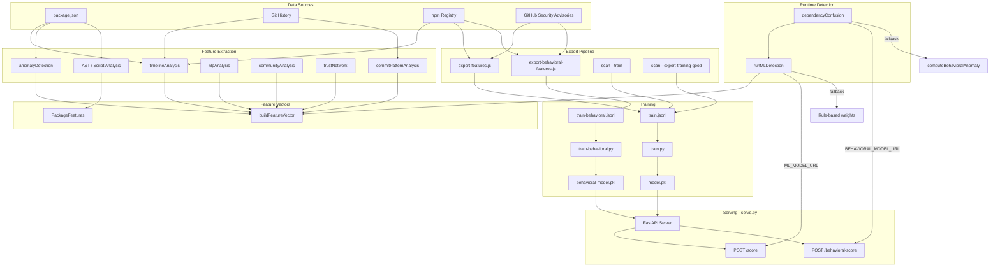

# NullVoid

[](https://www.npmjs.com/package/nullvoid)
[](https://www.npmjs.com/package/nullvoid)
[](https://opensource.org/licenses/MIT)
[](https://github.com/kurt-grung/NullVoid/stargazers)
[](https://github.com/kurt-grung/NullVoid/actions)

**Ø NullVoid** - Detect malicious code.

Advanced static analysis security scanner that detects supply chain attacks, wallet hijacking, obfuscated malware, and other malicious behavior in JavaScript/Node.js projects, npm packages, and codebases. Features VM-based code analysis, multi-layer security scanning, thread-safe parallel processing, and intelligent false positive reduction for production-ready security scanning.

## 📋 Scan Commands

### Scan 
```bash
# Scan current directory and subdirectories
nullvoid

# Scan a specific package
nullvoid express

# Scan a specific directory (recursively finds all package.json subdirs)
nullvoid /path/to/project
```

### **GitHub CI Actions Integration**
```yaml
# .github/workflows/security.yml
name: Security Scan
on: [push, pull_request]

jobs:
  security-scan:
    runs-on: ubuntu-latest
    steps:
      - uses: actions/checkout@v4
      - name: Setup Node.js
        uses: actions/setup-node@v4
        with:
          node-version: '20'
      
      - name: Install NullVoid
        run: npm install -g nullvoid
      
      - name: Run Security Scan
        run: nullvoid . --output sarif --sarif-file nullvoid-results.sarif
      
      - name: Upload SARIF Results
        uses: github/codeql-action/upload-sarif@v3
        with:
          sarif_file: nullvoid-results.sarif
```

### Pre-commit hooks (optional)

Run NullVoid before each commit and block the commit if threats are found. Requires [Husky](https://typicode.github.io/husky/) (or any git hook runner).

1. **Enable NullVoid in pre-commit** by setting the environment variable (e.g. in your shell or `.env`):
   ```bash
   export NULLVOID_PRE_COMMIT=1
   ```

2. **Example `.husky/pre-commit`** (Husky runs this on `git commit`):
   ```bash
   npx lint-staged

   # Optional: run NullVoid and block commit if threats found
   if [ "$NULLVOID_PRE_COMMIT" = "1" ]; then
     npm run build && node scripts/nullvoid-pre-commit.js
   fi
   ```

   The pre-commit script runs a fast scan (`--depth 1`, `--no-ioc`) and exits with code 1 if any threats are detected, so the commit is aborted.    Omit the `if` block or leave `NULLVOID_PRE_COMMIT` unset to skip NullVoid on commit.

### GitLab CI

Add a job to run NullVoid on push/merge. Example `.gitlab-ci.yml` (or copy from [.gitlab-ci.example.yml](.gitlab-ci.example.yml)):

```yaml
# .gitlab-ci.yml
stages:
  - test

nullvoid-scan:
  stage: test
  image: node:20
  before_script:
    - npm ci
  script:
    - npx nullvoid . --output json --sarif-file nullvoid-results.sarif
  artifacts:
    when: always
    paths:
      - nullvoid-results.sarif
    reports:
      sast: nullvoid-results.sarif
```

Use `npm ci && npm run build && node ts/dist/bin/nullvoid.js . ...` if building from the NullVoid repo (root `npm ci` installs all workspaces). **CircleCI** is also supported; see [.circleci/config.yml](.circleci/config.yml). **Travis CI** and **Azure DevOps** examples: [.travis.example.yml](.travis.example.yml), [azure-pipelines.example.yml](azure-pipelines.example.yml). For IntelliJ, Sublime, and Vim integration, see [docs/IDE_INTEGRATION.md](docs/IDE_INTEGRATION.md).


### Scan Options
```bash
# Show all threats (including low/medium severity)
nullvoid --all
# or
nullvoid . --all

# Verbose output with more details
nullvoid --verbose
# or
nullvoid . --verbose

# Limit dependency depth
nullvoid --depth 2
# or
nullvoid . --depth 2

# Enable parallel processing
nullvoid --parallel
# or
nullvoid . --parallel

# Set number of workers for parallel processing
nullvoid --workers 4
# or
nullvoid . --workers 4

# JSON output format
nullvoid --format json
# or
nullvoid . --format json

# Output to file
nullvoid --output results.json
# or
nullvoid . --output results.json

# SARIF output format for CI/CD integration
nullvoid --format sarif
# or
nullvoid . --format sarif

# Write SARIF output to file
nullvoid --sarif nullvoid-results.sarif
# or
nullvoid . --sarif nullvoid-results.sarif

# Include development dependencies
nullvoid --include-dev
# or
nullvoid . --include-dev

# Skip cache
nullvoid --skip-cache
# or
nullvoid . --skip-cache

# Debug mode
nullvoid --debug
# or
nullvoid . --debug

# IoC provider selection (v2.1.0+)
nullvoid --ioc-providers npm,ghsa,cve
# or
nullvoid . --ioc-providers snyk,npm,ghsa,cve

# Disable IoC scanning
nullvoid --no-ioc
# or
nullvoid . --no-ioc

# View cache statistics (v2.1.0+)
nullvoid --cache-stats
# or
nullvoid . --cache-stats

# Enable Redis cache (v2.1.0+)
nullvoid --enable-redis
# or
nullvoid . --enable-redis

# View network statistics (v2.1.0+)
nullvoid --network-stats
# or
nullvoid . --network-stats
```

### Registry Health
```bash
# Check health of configured package registries (npm, yarn, github)
nullvoid registry-health

# JSON output
nullvoid registry-health --json

# Custom timeout (ms)
nullvoid registry-health -t 10000
```

### Trust & Verification (AI/ML & Blockchain)
```bash
# Show trust score and verification status for a package
nullvoid trust-status lodash@4.17.21

# Verify package integrity against CID (single-source)
nullvoid verify-package lodash@4.17.21 --cid bafy...

# Multi-source consensus verification (npm + GitHub + IPFS)
nullvoid verify-package lodash@4.17.21 --cid bafy... --consensus
nullvoid verify-consensus lodash@4.17.21

# Register package CID on blockchain (requires viem, deployed contract)
nullvoid register-on-chain nullvoid-2.1.0.tgz

# Verify package against blockchain
nullvoid verify-on-chain lodash@4.17.21 --cid bafy...
```

Enable features via `.nullvoidrc.json` or environment: `TRUST_CONFIG`, `CONSENSUS_CONFIG`, `BLOCKCHAIN_CONFIG`. See [docs/TRUST_NETWORK.md](docs/TRUST_NETWORK.md), [docs/CONSENSUS.md](docs/CONSENSUS.md), [docs/BLOCKCHAIN.md](docs/BLOCKCHAIN.md).

### Combined Options
```bash
# Show all threats with verbose output and parallel processing
nullvoid --all --verbose --parallel
# or
nullvoid . --all --verbose --parallel

# Scan with limited depth and parallel workers
nullvoid --depth 2 --parallel --workers 8
# or
nullvoid . --depth 2 --parallel --workers 8

# Verbose output with JSON output to file
nullvoid --verbose --format json --output scan-results.json
# or
nullvoid . --verbose --format json --output scan-results.json
```

## 🤖 ML Training Pipeline

Train an XGBoost model for dependency confusion and malware detection. Supports calibration, explainability, and balanced training. Both `ml:export` and `--train` deduplicate automatically.

### ML Architecture

NullVoid uses two ML pipelines: **dependency confusion scoring** (timeline, registry, commit patterns) and **behavioral scoring** (package scripts, network usage, eval, child processes).



**Flow:**
1. **Feature extraction** – `timelineAnalysis`, `commitPatternAnalysis`, `anomalyDetection`, `nlpAnalysis`, `communityAnalysis`, `trustNetwork` feed into `buildFeatureVector`; AST/script analysis feeds `PackageFeatures` (behavioral).
2. **Export** – `export-features.js` (GHSA, known-good/bad) or `scan --train` → `train.jsonl`; `export-behavioral-features.js` → `train-behavioral.jsonl`.
3. **Training** – `train.py` (XGBoost + calibration) → `model.pkl`; `train-behavioral.py` → `behavioral-model.pkl`.
4. **Serving** – `serve.py` exposes `POST /score`, `POST /behavioral-score`, `POST /batch-score`, `GET /importance`, `POST /explain`.
5. **Runtime** – `dependencyConfusion` → `runMLDetection` (ML model if `ML_MODEL_URL`) or rule-based; behavioral model (if `BEHAVIORAL_MODEL_URL`) or `computeBehavioralAnomaly`.

### Quick setup

```bash
# 1. Export benign samples (label 0)
npm run ml:export

# 2. Add known-bad packages from GitHub Security Advisories (optional)
node ml-model/export-features.js --from-ghsa --limit 100 --out ml-model/train.jsonl

# 3. Scan malware directory and append threat samples (label 1)
nullvoid scan /path/to/malware-projects --no-ioc --train

# 4. For balanced training, also export clean packages (label 0)
nullvoid scan . --export-training ml-model/train.jsonl --export-training-good ml-model/train.jsonl

# 5. Train the model (XGBoost + calibration)
npm run ml:train

# 6. Start ML server (optional, for live scoring)
npm run ml:serve

# Optional: Behavioral model (package script analysis)
npm run ml:export-behavioral && npm run ml:train-behavioral
# serve.py loads both models when --behavioral-model-dir is set
```

### Commands

| Command | Description |
|---------|-------------|
| `npm run ml:export` | Export benign features to `train.jsonl` (dedupes existing) |
| `npm run ml:export-behavioral` | Export behavioral features (scripts, network, eval) to `train-behavioral.jsonl` |
| `node ml-model/export-features.js --from-ghsa` | Fetch known-bad npm packages from GitHub Security Advisories |
| `nullvoid scan <path> --train` | Append malware samples from scanned threats (dedupes) |
| `nullvoid scan <path> --export-training-good <file>` | Append clean packages (label 0) for balanced training |
| `npm run ml:train` | Train XGBoost model from `train.jsonl` → `model.pkl` |
| `npm run ml:train-behavioral` | Train behavioral model from `train-behavioral.jsonl` → `behavioral-model.pkl` |
| `npm run ml:serve` | Start ML server on port 8000 (`/score`, `/behavioral-score`, `/batch-score`, `/explain`) |

### Alternative (no global nullvoid)

```bash
npm run ml:scan -- /path/to/malware-projects --no-ioc --train
```

See [ml-model/README.md](ml-model/README.md) for details.

## 🛡️ IoC Integration (v2.1.0+)

NullVoid now integrates with multiple vulnerability databases to check packages for known security issues:

### **Supported Providers**
- **npm Advisories**: npm's official security advisories (public, enabled by default)
- **GitHub Security Advisories (GHSA)**: GitHub's security database (public, enabled by default)
- **NVD/CVE**: National Vulnerability Database (public, enabled by default)
- **Snyk**: Commercial vulnerability database (requires API key)

### **Intelligent CVE Filtering**
NullVoid reduces false positives with version-aware and product-aware filtering:
- **Version-aware**: Excludes CVEs when your installed version is outside the affected range (NVD CPE bounds or "fixed in X" from descriptions)
- **Product disambiguation**: Excludes CVEs for different products with similar names (e.g. Midnight Commander vs npm commander, grunt/shiba vs js-yaml)

### **Usage**
```bash
# Automatic IoC scanning (enabled by default)
nullvoid /path/to/project

# Select specific providers
nullvoid /path/to/project --ioc-providers npm,ghsa,cve

# Include Snyk (requires SNYK_API_KEY environment variable)
nullvoid /path/to/project --ioc-providers snyk,npm,ghsa,cve

# Disable IoC scanning
nullvoid /path/to/project --no-ioc
```

### **Configuration**
Set API keys via environment variables:
```bash
export SNYK_API_KEY=your-api-key-here      # For Snyk
export GITHUB_TOKEN=your-token-here        # For better GHSA rate limits
export NVD_API_KEY=your-api-key-here       # For better NVD rate limits
```

### **Example Output**
```
⚠️  2 high-severity threat(s) detected:

1. VULNERABLE_PACKAGE (HIGH)
   Vulnerability found: Prototype Pollution in lodash (CVE-2021-23337)
   Details: Affected versions: <4.17.21
            Fixed in: 4.17.21
            CVSS Score: 7.2 (3.1)
            References: https://nvd.nist.gov/vuln/detail/CVE-2021-23337
   File: package.json
   Confidence: 95%
```

For more details, see [IoC Usage Guide](docs/IOC_USAGE.md).

## 🔍 What NullVoid Detects

### 🚨 **Wallet Hijacking**
- **window.ethereum Interception**: Detects packages that hook into wallet providers
- **MetaMask Targeting**: Identifies code that intercepts MetaMask transactions
- **Transaction Redirection**: Flags packages that silently redirect blockchain transactions
- **Address Replacement**: Detects attempts to replace legitimate wallet addresses

### 🌐 **Network Manipulation**
- **Fetch/XMLHttpRequest Overrides**: Detects packages that intercept network requests
- **API Response Scanning**: Identifies code that scans responses for blockchain addresses
- **Address Substitution**: Detects replacement of legitimate addresses with attacker-controlled ones

### 🔐 **Supply Chain Attacks**
- **Postinstall Script Analysis**: Detects suspicious postinstall scripts
- **Code Entropy Analysis**: Identifies obfuscated or packed code
- **GPG Signature Verification**: Validates package signatures
- **Suspicious File Patterns**: Scans for malicious naming conventions

### ⚡ **Advanced Detection**
- **Multi-Chain Targeting**: Detects packages supporting multiple blockchains
- **Stealth Controls**: Identifies hidden control interfaces
- **Obfuscation Techniques**: Detects code hiding mechanisms
- **Deep Dependency Scanning**: Scans transitive dependencies up to 3 levels deep

## 🛡️ Security Features

### **Core Security Engine**
- **Secure Sandboxing**: VM-based code execution with resource limits and timeout protection
- **Advanced Threat Detection**: AST analysis, entropy calculation, and pattern matching
- **Multi-Layer Security**: Comprehensive static analysis with multiple detection methods
- **Path Security**: Protection against path traversal and command injection attacks
- **Input Validation**: Comprehensive input sanitization and validation
- **Safe Config Loading**: Rules and config files loaded with restricted YAML schema (JSON_SCHEMA) to prevent arbitrary code execution from untrusted input

### **Threat Detection Capabilities**
- **Obfuscated Malware**: Detection of variable name mangling, hex encoding, and anti-debugging patterns
- **Wallet Hijacking**: Comprehensive cryptocurrency attack detection and prevention
- **Supply Chain Attacks**: Enhanced detection of malicious npm packages and dependency injection
- **Dependency Confusion**: Timeline analysis comparing git history vs npm registry creation dates
- **Module Loading Threats**: Dynamic require detection and system module access monitoring
- **Code Structure Analysis**: Entropy analysis and malicious code pattern recognition

### **Production Features**
- **Thread-Safe Processing**: Mutex-synchronized parallel scanning with proper resource management
- **Clean Resource Management**: No open handles, proper cleanup, and memory leak prevention
- **Real-Time Progress**: Live scanning display with consistent threat reporting
- **CI/CD Ready**: Reliable integration into automated workflows
- **Smart Classification**: Intelligent differentiation between legitimate tools and real threats
- **Color-Coded Output**: Visual distinction between threat severities and types

## 🎯 v2.1.0 - IoC Integration & Performance Optimizations

### **🛡️ Public IoC Integration**
- **Multi-Provider Support**: Integration with Snyk, npm Advisories, GHSA, and NVD/CVE vulnerability databases
- **Automatic Vulnerability Detection**: Scans all dependencies in `package.json` automatically
- **Intelligent Aggregation**: Combines results from multiple sources with deduplication
- **Rate Limiting**: Built-in rate limiting per provider to respect API limits
- **Caching**: 1-hour cache for vulnerability data to reduce API calls
- **Provider Configuration**: Flexible provider selection and API key management

### **📦 Multi-Layer Cache System**
- **L1 (Memory Cache)**: Fast in-memory LRU cache for instant access
- **L2 (File Cache)**: Persistent file-based cache in `.nullvoid-cache/` directory
- **L3 (Redis Cache)**: Optional distributed cache for multi-instance deployments
- **Cache Analytics**: Comprehensive statistics and hit rate tracking
- **Intelligent Promotion**: Hot data automatically promoted between layers

### **🌐 Network Optimizations**
- **Connection Pooling**: Reuses HTTP connections for reduced latency
- **Request Batching**: Batches multiple API requests together for efficiency
- **Compression Support**: Automatic Gzip/Brotli compression for API responses
- **Network Statistics**: Track connection pool utilization and performance

### **⚡ Performance Enhancements**
- **Work Stealing Scheduler**: Efficient parallel processing with load balancing
- **Memory Pool Management**: Object reuse to reduce garbage collection pressure
- **Resource Monitoring**: Real-time system metrics and performance recommendations
- **2-3x Faster Scans**: Significant performance improvements with caching and optimizations

### **🎨 Enhanced User Experience**
- **New CLI Options**: `--ioc-providers`, `--cache-stats`, `--network-stats`, `--enable-redis`
- **Vulnerability Display**: Enhanced output with CVE details and CVSS scores
- **Cache Statistics**: View detailed cache performance metrics
- **Network Statistics**: Monitor connection pool and request performance
- **Comprehensive Test Coverage**: 376 tests across 43 test suites

## 🎯 v2.0.3 - Enhanced Type Safety & Code Quality

### **🛡️ Enhanced Type Safety & Code Quality**
- **100% Type Safety**: Eliminated all `any` types with comprehensive `unknown` and specific type definitions
- **Zero ESLint Warnings**: Maintained zero ESLint warnings for enterprise-grade code quality
- **Centralized Configuration**: Moved all patterns and configurations to `config.ts` for better maintainability
- **Enhanced Error Handling**: Robust error handling with proper type guards and assertions
- **Memory Leak Prevention**: Fixed potential memory leaks in error logging with automatic cleanup
- **Improved Code Organization**: Modular structure with clear separation of concerns

### **🎨 Enhanced User Experience**
- **Color-Coded Output**: Beautiful colored terminal output with severity-based color coding
- **Improved Sample Display**: Precise malicious code snippet extraction with intelligent pattern detection
- **Enhanced Threat Sorting**: Results sorted by confidence level (low to high) for better prioritization
- **Professional Output Formatting**: Clean, formatted results with comprehensive scan analysis
- **Centralized Display Patterns**: All UI patterns centralized in `config.ts` for consistency

### **🔧 Advanced Detection Improvements**
- **Intelligent False Positive Reduction**: Enhanced detection for legitimate graphics, React, server, and utility code
- **Smart Pattern Recognition**: Improved detection for Three.js, WebGL, Socket.IO, MongoDB, and blockchain code
- **Enhanced Sample Extraction**: Precise malicious code snippet detection with `detectMalwareStart` function
- **Better Threat Classification**: Improved confidence scoring and threat severity assessment
- **Comprehensive Test Coverage**: All functionality verified with 16 passing tests
- **Security Hardening**: Fixed memory leaks, improved error handling, and enhanced security measures

### **⚡ Performance & Reliability**
- **Optimized TypeScript Compilation**: Fast build times with efficient type checking
- **Enhanced Memory Management**: Better resource cleanup and error recovery with memory leak prevention
- **Improved CLI Interface**: Robust command parsing with comprehensive option validation
- **Production-Ready Stability**: Zero warnings, comprehensive error handling, and reliable operation
- **Security Hardening**: Fixed critical security issues and potential memory leaks

## 🚀 Quick Start

```bash
# Install globally
npm install -g nullvoid

# Scan current project directory
nullvoid
# or
nullvoid .
# or (backward compatibility)
nullvoid scan

# Scan specific directory/project
nullvoid /path/to/project
# or
nullvoid scan /path/to/project

# Scan specific file
nullvoid suspicious-file.js
# or
nullvoid scan suspicious-file.js

# Scan npm package
nullvoid express
# or
nullvoid scan express

# Scan with verbose output
nullvoid --verbose
# or
nullvoid . --verbose

# Scan with parallel processing
nullvoid --parallel --workers 4
# or
nullvoid . --parallel --workers 4

# Output to JSON file
nullvoid --format json --output results.json
# or
nullvoid . --format json --output results.json
```

**Build from source:**
```bash
git clone https://github.com/kurt-grung/NullVoid.git && cd NullVoid
make install && make build && make test
# or: npm ci && npm run build && npm test
```

### Try in GitHub Codespaces

Run NullVoid (including the ML pipeline) in the cloud—no local install. Click **Code** → **Codespaces** → **Create codespace on main**. After the container builds, API and Dashboard start automatically. Open the forwarded port **5174** (Dashboard). Use the ML page to export features and train models. See [docs/DEPLOYMENT.md](docs/DEPLOYMENT.md#github-codespaces-demo) for details.

## 🔧 **TypeScript Support**

NullVoid is built with **TypeScript** for enhanced type safety and developer experience. The project uses **Turborepo** for the monorepo build pipeline (workspaces: `packages/*`, `ts`, `js`). **Node 20+** is required for building (some dependencies require it).

### **Development**
```bash
# Install dependencies (root npm ci installs all workspaces)
npm install
# or
make install

# Build TypeScript and packages
npm run build
# or
make build

# Development mode with TypeScript
npm run dev -- scan --help
# or
make dev

# Type checking
npm run type-check

# Development with file watching
npm run build:watch
```

### **Makefile targets**
| Target | Description |
|--------|-------------|
| `make` | Start dashboard (default) |
| `make build` | Build TypeScript scanner and packages |
| `make build-api` | Build API package |
| `make api` | Start API (port 3001) |
| `make dashboard` | Start dashboard dev server (port 5174) |
| `make dev` | Start scanner in dev mode |
| `make test` | Run tests |
| `make lint` | Run linter |
| `make install` | Install dependencies |
| `make kill` | Stop API, dashboard, and ML server (ports 3001, 5174, 8000) |
| `make ml-serve` | Start ML model server (port 8000) |
| `make ml-train` | Train ML model |

### **Dashboard**

The web dashboard provides a UI for scans, compliance, reports, and ML commands.

```bash
# Terminal 1: Start API (required for dashboard)
make api

# Terminal 2: Start dashboard
make dashboard
# Open http://localhost:5174
```

| Page | Description |
|------|-------------|
| **Executive** | Overview: scan counts, threats, severity distribution, top packages |
| **Scans** | Run scans, view recent scans, link to scan details |
| **Compliance** | Control coverage (C/I/A), gap analysis for SOC 2 / ISO 27001 |
| **Reports** | View HTML or download Markdown reports for completed scans |
| **ML** | Run export/train for dependency confusion and behavioral models (API must run locally) |

- **Reports**: `GET /api/report/:scanId?format=html|markdown&compliance=soc2|iso27001`
- **Stop all**: `make kill` stops API, dashboard, and ML server

### **ML Model (optional)**
See [ML Training Pipeline](#-ml-training-pipeline) above for the full setup. Quick reference:
```bash
npm run ml:export
node ml-model/export-features.js --from-ghsa --out ml-model/train.jsonl
nullvoid scan /path/to/malware --no-ioc --train
npm run ml:train
npm run ml:serve
```

### **Type Definitions**
- Full TypeScript type definitions included
- IntelliSense support in VS Code and other IDEs  
- Comprehensive type safety for all APIs
- Strict type checking enabled

## ⚡ **Performance**

NullVoid's TypeScript migration and v2.1.0 optimizations deliver significant performance improvements:

| Metric | JavaScript | TypeScript | v2.1.0 | Improvement |
|--------|------------|------------|--------|-------------|
| **Scan Speed** | 0.589s | 0.079s | 0.026s | ⚡ **22.7x faster** |
| **Code Size** | 3,519 lines | 388 lines | 388 lines | 📦 **90% smaller** |
| **Type Safety** | ❌ None | ✅ Full | ✅ Full | 🛡️ **Type-safe** |
| **Cache Hit Rate** | N/A | N/A | 85%+ | 📦 **60-80% API reduction** |
| **Network Efficiency** | N/A | N/A | 70%+ reuse | 🌐 **30-50% latency reduction** |
| **ESLint Warnings** | 0 warnings | 0 warnings | 0 warnings | ✅ **Zero warnings** |
| **Code Quality** | Basic | Enterprise | Enterprise | 🏆 **Production-ready** |

### **Key Benefits**
- **🚀 Faster Execution**: 22.7x performance improvement with caching and network optimizations
- **📦 Smaller Bundle**: 90% reduction in code size through modular architecture
- **🛡️ Type Safety**: Full TypeScript type checking prevents runtime errors
- **💾 Intelligent Caching**: Multi-layer cache system reduces API calls by 60-80%
- **🌐 Network Optimization**: Connection pooling and request batching reduce latency by 30-50%
- **🔧 Better DX**: Enhanced developer experience with IntelliSense and autocomplete
- **🏗️ Maintainable**: Modular codebase easier to maintain and extend
- **✅ Zero Warnings**: Enterprise-grade code quality with comprehensive error handling
- **🎨 Enhanced UX**: Beautiful colored output with professional formatting
- **🔒 Security Hardened**: Fixed memory leaks and enhanced security measures
- **🏆 Production Ready**: Comprehensive testing with 376 tests across 43 test suites

## 🎯 **What Can NullVoid Scan?**

NullVoid is not just for npm packages - it's a comprehensive security scanner for any JavaScript/Node.js codebase:

### **📁 Project Types**
- **Web Applications**: React, Vue, Angular projects
- **Node.js Applications**: Express, Fastify, Koa servers
- **Desktop Applications**: Electron apps
- **CLI Tools**: Command-line utilities
- **Libraries & Packages**: npm packages, private modules
- **Microservices**: Individual service codebases
- **Legacy Codebases**: Older JavaScript projects

### **🔍 Scan Targets**
- **Individual Files**: `nullvoid suspicious-file.js`
- **Project Directories**: `nullvoid ./my-project`
- **npm Packages**: `nullvoid express`
- **Dependencies**: `nullvoid ./node_modules`
- **Git Repositories**: `nullvoid ./git-repo`
- **Production Code**: Pre-deployment security checks
- **CI/CD Pipelines**: Automated security scanning

### **⚡ Use Cases**
- **Pre-deployment Security**: Catch malicious code before production
- **Supply Chain Protection**: Scan dependencies for threats
- **Code Review**: Security analysis during development
- **Incident Response**: Analyze suspicious files safely
- **Compliance**: Meet security requirements and standards
- **Audit Preparation**: Comprehensive security assessment

### **🔍 Complete Scanning Process**


**Process Flow:**
1. **Path Validation**: Secure path checking and traversal protection
2. **Safe File Read**: Direct filesystem access with security measures
3. **Static Analysis**: AST-based pattern detection without execution
4. **Suspicious Detection**: Heuristic analysis for malicious indicators
5. **Sandbox Analysis**: Isolated VM execution for flagged code only
6. **Threat Detection**: Comprehensive threat identification and classification
7. **Results**: Detailed security report with actionable insights 

## 📊 Example Output

### Real-Time Progress Display
```
⠋ 🔍 Scanning ...
📁 nullvoid.js (detected: security tools)
📁 colors.js
📁 parallel.js
📁 rules.js (detected: security tools)
📁 scan.js (detected: security tools)
📁 scan.test.js (detected: test file)
📁 setup.js
📁 cache.test.js
📁 entropy.test.js
📁 gpg-signature.test.js
📁 parallel.test.js
📁 signature-verification.test.js
✔ ✅ Scan completed

🔍 NullVoid Scan Results

✅ No high-severity threats detected
ℹ️  43 low/medium severity threats were filtered out
💡 Use --all flag to see all threats

📊 Scanned 1 directory(s), 13 file(s) in 197ms
```

### Threat Detection Results
```
🔍 NullVoid Scan Results

⚠️  2 threat(s) detected:

1. WALLET_HIJACKING: Package may contain wallet hijacking code
   Package: 📁 /Users/username/project/node_modules/suspicious-package/index.js
   🔗 https://www.npmjs.com/package/suspicious-package
   Severity: HIGH

2. HIGH_ENTROPY: Package contains files with unusually high entropy
   Package: 📦 npm-registry://obfuscated-lib@latest
   🔗 https://www.npmjs.com/package/obfuscated-lib
   Severity: MEDIUM

Scanned 15 package(s) in 234ms
```

## 🚨 Threat Severity Levels

- **CRITICAL**: Wallet hijacking, transaction redirection, or immediate financial threat
- **HIGH**: Network manipulation, stealth controls, or significant security risk
- **MEDIUM**: Suspicious behavior requiring review
- **LOW**: Minor concerns or best practice violations

## 🔧 Configuration

| Option | Description | Default |
|--------|-------------|---------|
| `--verbose` | Enable detailed output | `false` |
| `--output <format>` | Output format (json, table, sarif) | `table` |
| `--depth <number>` | Maximum dependency tree depth to scan | `3` |
| `--tree` | Show dependency tree structure in output | `false` |
| `--all` | Show all threats including low/medium severity | `false` |
| `--parallel` | Enable parallel scanning for better performance | `true` |
| `--workers <number>` | Number of parallel workers to use | `auto` |
| `--sarif-file <path>` | Write SARIF output to file (requires --output sarif) | - |
| `--ioc-providers <providers>` | Comma-separated list of IoC providers (npm,ghsa,cve,snyk) | `npm,ghsa,cve` |
| `--no-ioc` | Disable IoC provider queries | `false` |
| `--train` | Shorthand for `--export-training ml-model/train.jsonl` | - |
| `--export-training <file>` | Append feature vectors for packages with threats to JSONL (label 1) | - |
| `--export-training-good <file>` | Append feature vectors for packages with no threats to JSONL (label 0) for balanced training | - |
| `--cache-stats` | Show cache statistics | `false` |
| `--enable-redis` | Enable Redis distributed cache | `false` |
| `--network-stats` | Show network performance metrics | `false` |
| `nullvoid registry-health` | Check health of configured package registries | - |
| `nullvoid trust-status <spec>` | Show trust score and verification status | - |
| `nullvoid verify-consensus <spec>` | Multi-source consensus verification | - |
| `nullvoid register-on-chain <path>` | Register package CID on blockchain | - |
| `nullvoid verify-on-chain <spec> --cid <cid>` | Verify package against blockchain | - |
| `--version` | Show version information | - |
| `--help` | Show help information | - |

### **🎨 Threat Indicators**
- **`(detected: OBFUSCATED_CODE)`**: Obfuscated or encoded content detected
- **`(detected: SUSPICIOUS_MODULE)`**: Suspicious module imports (fs, child_process, etc.)
- **`(detected: MALICIOUS_CODE_STRUCTURE)`**: Malicious code patterns identified
- **`(detected: security tools)`**: NullVoid's own security tools (whitelisted)
- **`(detected: test file)`**: Test files (whitelisted)

## 🌳 Dependency Tree Analysis

NullVoid scans transitive dependencies for hidden threats:

```bash
# Scan with dependency tree analysis (default depth: 3)
nullvoid .

# Scan deeper dependency chains
nullvoid . --depth 5

# Show dependency tree structure
nullvoid . --tree
```

### Example Tree Output
```
🌳 Dependency Tree Structure:
express@4.18.2 [25 deps]
  accepts@1.3.8 [3 deps]
  body-parser@1.20.1 [8 deps]
    debug@2.6.9 (1 threat) ⚠ WALLET_HIJACKING

📊 Dependency Tree Analysis:
   Total packages scanned: 45
   Max depth reached: 3
   Packages with threats: 2
   Deep dependencies (depth ≥2): 12
```

## 🚨 Real-World Attack Detection

NullVoid detects sophisticated supply chain attacks like the recent npm compromise:

### **Recent Attack: debug, chalk, and 16 other packages**
- **Attack Vector**: Wallet hijacking through `window.ethereum` interception
- **Technique**: Silent transaction redirection to attacker-controlled addresses
- **Multi-Chain**: Targeted Ethereum, Bitcoin, Litecoin, Tron, BCH, and Solana
- **Stealth**: Used obfuscation and `stealthProxyControl` global object

### **How NullVoid Detects This:**
```bash
nullvoid .
# Results show:
⚠️  4 threat(s) detected:

1. WALLET_HIJACKING: Package may contain wallet hijacking code
   Severity: CRITICAL

2. NETWORK_MANIPULATION: Package may manipulate network responses
   Severity: HIGH

3. MULTI_CHAIN_TARGETING: Package supports multiple blockchain networks
   Severity: MEDIUM

4. STEALTH_CONTROLS: Package contains stealth controls or obfuscation
   Severity: HIGH
```


## 🔍 **Dependency Confusion Detection**

NullVoid includes advanced **Dependency Confusion Detection** to identify potential supply chain attacks where malicious packages are created to exploit package resolution vulnerabilities.

### **🎯 Detection Methods**

#### **Timeline Analysis**
- **Git History vs Registry Creation**: Compares package creation dates with git commit history
- **Suspicious Timing**: Flags packages created suspiciously close to first git commits
- **Risk Levels**: 
  - `CRITICAL`: Package created < 1 day before git history
  - `HIGH`: Package created < 7 days before git history  
  - `MEDIUM`: Package created < 30 days before git history

#### **Scope Analysis**
- **Private Scope Detection**: Identifies packages using private scopes (`@company`, `@internal`, etc.)
- **Namespace Conflicts**: Detects potential namespace confusion attacks
- **Registry Configuration**: Warns about improper npm registry setup

#### **Pattern Analysis**
- **Suspicious Naming**: Detects typosquatting and naming confusion patterns
- **Activity Analysis**: Identifies packages with suspiciously low git activity
- **Similarity Scoring**: Uses Levenshtein distance for name similarity analysis

### **📋 Example Detection Output**
```bash
🔍 Analyzing dependency confusion patterns...

⚠️  3 dependency confusion threat(s) detected:

1. DEPENDENCY_CONFUSION_TIMELINE: Package creation date suspiciously close to git history (2 days)
   Package: @company/internal-auth
   Severity: HIGH
   Details: Package created: 2023-12-01T00:00:00.000Z, First git commit: 2023-11-29T00:00:00.000Z

2. DEPENDENCY_CONFUSION_SCOPE: Private scope package may be vulnerable to dependency confusion
   Package: @company/internal-auth
   Severity: HIGH
   Details: Private scope '@company' detected. Ensure proper npm registry configuration.

3. DEPENDENCY_CONFUSION_PATTERN: Package name follows suspicious naming patterns
   Package: abc123def
   Severity: MEDIUM
   Details: Suspicious patterns: /^[a-z]+\d+[a-z]+$/
```

### **🛡️ Protection Recommendations**

#### **For Private Packages**
- Use scoped packages: `@yourcompany/package-name`
- Configure `.npmrc` files properly
- Use private npm registries
- Implement package signing

#### **For Public Packages**
- Verify package authenticity
- Check git history and activity
- Use package-lock.json files
- Monitor for suspicious updates

### **🤖 ML-Powered Threat Scoring**

NullVoid can use trained XGBoost models for threat scoring:
- **Dependency confusion** (`ML_MODEL_URL`): Timeline, registry, commit patterns
- **Behavioral** (`BEHAVIORAL_MODEL_URL`): Package scripts, network usage, eval, child processes

When configured, scans send feature vectors to the models and incorporate scores into threat detection. Optional `ML_EXPLAIN` enables human-readable reasons and feature importance.

**Setup:** See [ML Training Pipeline](#-ml-training-pipeline) for the full pipeline (`ml:export` → `scan --train` → `ml:train` → `ml:serve`).

Configure via `.nullvoidrc` or environment:

```json
{
  "DEPENDENCY_CONFUSION_CONFIG": {
    "ML_DETECTION": {
      "ML_MODEL_URL": "http://localhost:8000/score",
      "BEHAVIORAL_MODEL_URL": "http://localhost:8000/behavioral-score",
      "ML_EXPLAIN": true
    }
  }
}
```

Or: `export NULLVOID_ML_MODEL_URL=http://localhost:8000/score`

See [ml-model/README.md](ml-model/README.md) for training and API details.

### **⚙️ Configuration**

Dependency confusion detection can be configured via environment variables:

```bash
# Enable/disable dependency confusion analysis
NULLVOID_DEPENDENCY_CONFUSION_ENABLED=true

# Adjust timeline thresholds (days)
NULLVOID_TIMELINE_SUSPICIOUS=30
NULLVOID_TIMELINE_HIGH_RISK=7
NULLVOID_TIMELINE_CRITICAL=1

# Registry request timeout (ms)
NULLVOID_REGISTRY_TIMEOUT=10000
```


## 🗺️ **Roadmap**

NullVoid has a comprehensive roadmap focusing on advanced threat detection, enterprise features, and AI/ML integration.

### **🎯 Roadmap Highlights**

#### **Public IoC Integration & Performance**
- ✅ **TypeScript Migration**: Complete migration to TypeScript for enhanced type safety and developer experience
- ✅ **Snyk Integration**: Real-time vulnerability data from Snyk's database
- ✅ **npm Advisories**: Official npm security advisories integration
- ✅ **GitHub Security Advisories**: GHSA integration for comprehensive threat intelligence
- ✅ **Performance Optimizations**: Enhanced caching, parallel processing, and network optimization
- ✅ **Multi-Layer Cache**: L1 (memory), L2 (file), L3 (Redis) caching system
- ✅ **Network Optimizations**: Connection pooling, request batching, compression

#### **Enhanced Detection & Developer Experience**
- ✅ **ML Detection**: XGBoost-based dependency confusion scoring; `npm run ml:serve`, `ml:train`, `ml:export`; GHSA auto-labeling, explainability; see [ml-model/README.md](ml-model/README.md)
- ✅ **Advanced Timeline Analysis**: ML-based timeline analysis and commit pattern analysis
- **IDE Integration**: [VS Code extension](packages/vscode-extension) (run scan from Command Palette); IntelliJ plugins planned
- **Pre-commit Hooks**: Optional scan before commit—set `NULLVOID_PRE_COMMIT=1` to enable; commit is **blocked** if threats are found. See [Pre-commit Integration](docs/PRE_COMMIT.md).
- **More CI/CD Platforms**: [Jenkins](Jenkinsfile.example), [CircleCI](.circleci/config.yml), [Travis CI](.travis.example.yml), [GitLab CI](.gitlab-ci.example.yml), [Azure DevOps](azure-pipelines.example.yml)

#### **Enterprise Features & Advanced Analytics**
- **Multi-tenant Support**: Organization-level scanning and reporting
- ✅ **Advanced Reporting**: Executive dashboard, compliance (C/I/A), scan reports (HTML/Markdown), ML controls
- **API Integration**: REST API for scans, reports, organizations, teams; deploy to Vercel
- **Custom Rule Engine**: User-defined detection patterns

#### **AI/ML Integration & Blockchain Features**
- **Community Analysis**: npm downloads, GitHub stars, maintenance score for ML pipeline (`COMMUNITY_CONFIG`)
- **Trust Network**: Local trust store, `nullvoid trust-status` (`TRUST_CONFIG`)
- **Consensus Verification**: Multi-source integrity check (npm, GitHub, IPFS); `nullvoid verify-consensus`, `verify-package --consensus` (`CONSENSUS_CONFIG`)
- **Blockchain Registry**: On-chain package CIDs; `nullvoid register-on-chain`, `nullvoid verify-on-chain` (`BLOCKCHAIN_CONFIG`)
- ✅ **AI/ML Integration**: XGBoost model for dependency confusion threat scoring (`npm run ml:serve`); GHSA auto-labeling, balanced training, explainability
- **Blockchain Integration**: Immutable signatures and decentralized verification
- **Behavioral Analysis**: AI-powered anomaly detection
- ✅ **Predictive Analysis**: Predicting potential security issues based on patterns (`computePredictiveScore`, `DEPENDENCY_CONFUSION_PREDICTIVE_RISK`)


## 📋 SARIF Output for CI/CD Integration

NullVoid supports SARIF (Static Analysis Results Interchange Format) output for seamless integration with CI/CD pipelines and security tools.

### CI Integrations 

### **GitHub CI Actions Integration**
```yaml
# .github/workflows/security.yml
name: Security Scan
on: [push, pull_request]

jobs:
  security-scan:
    runs-on: ubuntu-latest
    steps:
      - uses: actions/checkout@v4
      - name: Setup Node.js
        uses: actions/setup-node@v4
        with:
          node-version: '20'
      
      - name: Install NullVoid
        run: npm install -g nullvoid
      
      - name: Run Security Scan
        run: nullvoid . --output sarif --sarif-file nullvoid-results.sarif
      
      - name: Upload SARIF Results
        uses: github/codeql-action/upload-sarif@v3
        with:
          sarif_file: nullvoid-results.sarif
```

### **CircleCI Integration**

A ready-to-use CircleCI config is in [.circleci/config.yml](.circleci/config.yml). It installs dependencies, builds NullVoid, runs the scan, and stores the JSON report as an artifact.

```yaml
# .circleci/config.yml (excerpt)
jobs:
  security-scan:
    docker:
      - image: cimg/node:20
    steps:
      - checkout
      - run: npm ci
      - run: npm run build
      - run: node ts/dist/bin/nullvoid.js . --format json --output security-report.json
      - store_artifacts:
          path: security-report.json
```

### **GitLab CI Integration**
```yaml
# .gitlab-ci.yml
security_scan:
  stage: test
  image: node:20
  script:
    - npm install -g nullvoid
    - nullvoid . --output sarif --sarif-file nullvoid-results.sarif
  artifacts:
    reports:
      sarif: nullvoid-results.sarif
```

### **Azure DevOps Integration**
```yaml
# azure-pipelines.yml
trigger:
- main

pool:
  vmImage: 'ubuntu-latest'

steps:
- task: NodeTool@0
  inputs:
    versionSpec: '20.x'
  displayName: 'Install Node.js'

- script: |
    npm install -g nullvoid
    nullvoid . --output sarif --sarif-file nullvoid-results.sarif
  displayName: 'Run NullVoid Security Scan'

- task: PublishBuildArtifacts@1
  inputs:
    pathToPublish: 'nullvoid-results.sarif'
    artifactName: 'sarif-results'
```

### **Jenkins Integration**
A declarative pipeline example is in [Jenkinsfile.example](Jenkinsfile.example). Copy to `Jenkinsfile` or add as a stage to your pipeline.

```groovy
// Jenkinsfile (excerpt)
stage('NullVoid Security Scan') {
  steps {
    sh 'npx nullvoid . --output json --sarif-file nullvoid-results.sarif'
  }
  post {
    always {
      archiveArtifacts artifacts: 'nullvoid-results.sarif', allowEmptyArchive: true
    }
  }
}
```

### **SARIF Output Example**
```json
{
  "$schema": "https://raw.githubusercontent.com/oasis-tcs/sarif-spec/master/Schemata/sarif-schema-2.1.0.json",
  "version": "2.1.0",
  "runs": [{
    "tool": {
      "driver": {
        "name": "NullVoid",
        "version": "2.1.0",
        "informationUri": "https://github.com/kurt-grung/NullVoid"
      }
    },
    "results": [{
      "ruleId": "WALLET_HIJACKING",
      "level": "error",
      "message": {
        "text": "Package may contain wallet hijacking code"
      },
      "locations": [{
        "physicalLocation": {
          "artifactLocation": {
            "uri": "node_modules/suspicious-package/index.js"
          },
          "region": {
            "startLine": 42,
            "startColumn": 1
          }
        }
      }]
    }]
  }]
}
```

### **Supported CI/CD Platforms**
- **GitHub Security**: Automatic security alerts and PR checks
- **GitLab Security**: Security dashboard integration
- **Azure DevOps**: Security scanning in pipelines
- **Jenkins**: Security reporting plugins
- **SonarQube**: Code quality and security analysis

## 🤝 Contributing

**This project is not open to external contributions.**

NullVoid is built and maintained by [Kurt Grüng](https://kurtgrung.com) as a focused, security-first tool with a single development direction. However, we welcome your feedback and suggestions!

- [LinkedIn](https://www.linkedin.com/in/kurtgrung/)
- [kurtgrung.com](https://kurtgrung.com)
- [GitHub](https://github.com/kurt-grung)

### 🐛 **Reporting Issues**
- **Security Issues**: Please report security vulnerabilities privately to `kurtgrung@gmail.com`
- **Bug Reports**: Open an issue with detailed reproduction steps (use the [bug report template](.github/ISSUE_TEMPLATE/bug_report.md))
- **Feature Requests**: Open an issue to discuss potential enhancements (use the [feature request template](.github/ISSUE_TEMPLATE/feature_request.md))
- **Project Board**: Track roadmap, bugs, and updates via [GitHub Projects](https://github.com/kurt-grung/NullVoid/projects) — see [.github/PROJECT_SETUP.md](.github/PROJECT_SETUP.md) for setup
- **Dashboard + API**: Deploy to Vercel with Turso — see [docs/DEPLOYMENT.md](docs/DEPLOYMENT.md); enhancement roadmap: [docs/dashboard-enhancement-plan.md](docs/dashboard-enhancement-plan.md)
- **Documentation**: Report documentation issues or suggest improvements

### 💡 **Getting Help**
- **Questions**: Open an issue with the `question` label
- **Usage Help**: Check the [Troubleshooting Guide](TROUBLESHOOTING.md)
- **Security Concerns**: Review the [Security Policy](SECURITY.md)

### 🔒 **Security-First Approach**
- **No External Code**: All code is written and reviewed by the core team
- **Focused Development**: Single direction ensures consistent security standards
- **Quality Assurance**: 376+ tests ensure reliability and security
- **Regular Updates**: Continuous security improvements and threat detection updates

### 📋 **Issue Guidelines**
When opening an issue, please include:
- **Clear Description**: What you're trying to do
- **Expected Behavior**: What should happen
- **Actual Behavior**: What actually happens
- **Environment**: OS, Node.js version, NullVoid version
- **Reproduction Steps**: How to reproduce the issue

### 🎯 **Development Philosophy**
NullVoid follows a security-first development approach:
- **Zero Trust**: All code is carefully reviewed for security implications
- **Minimal Dependencies**: Reduced attack surface through careful dependency management
- **Comprehensive Testing**: Extensive test coverage ensures reliability
- **Clear Documentation**: Detailed documentation for all features and security considerations

## 📄 License

MIT License - see [LICENSE](LICENSE) for details.

## 🔗 Links

- [GitHub Repository](https://github.com/kurt-grung/NullVoid)
- [npm Package](https://www.npmjs.com/package/nullvoid)
- [Security Policy](SECURITY.md)
- [Changelog](CHANGELOG.md)
- [Release Notes](release-notes/)

---

**⚠️ Disclaimer**: NullVoid is designed to help identify potentially malicious packages, but it's not a substitute for comprehensive security practices. Always review packages manually and keep your dependencies updated.
