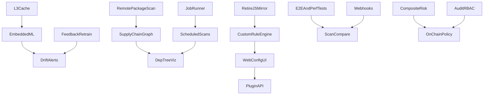

# NullVoid Advanced Roadmap

Phase-based roadmap for advanced improvements. No fixed calendar dates — progress is tracked by phase exit criteria.

See also: [ROADMAP.md](ROADMAP.md) (release history and current status), [dashboard-enhancement-plan.md](dashboard-enhancement-plan.md) (dashboard phases).

---

## Context (v2.1.0)

| Area | Status |
|------|--------|
| Core detection, IoC, SARIF, parallel scan | Complete |
| Trust / blockchain CLI | Complete |
| Dashboard Phases 1–3 | Complete |
| Dashboard Phases 4–5 | Not started |
| GitHub Projects board | See [PROJECT_SETUP.md](../.github/PROJECT_SETUP.md) |

### Known gaps

| Gap | Location |
|-----|----------|
| L3 Redis cache stub | `ts/src/lib/cache/multiLayerCache.ts` |
| ML runtime rule-based + optional HTTP | `ts/src/lib/mlDetection.ts` |
| No webhooks, GraphQL, schedules, audit log | `packages/api/src/index.ts` |
| Dual `js/` + `ts/` maintenance | `js/` workspace |
| No dashboard / VS Code E2E tests | `packages/dashboard/`, `packages/vscode-extension/` |

---

## Phase model

```mermaid
flowchart LR
  subgraph foundation [Phase0_Foundation]
    Debt[RetireJSMirror]
    Tests[E2EAndPerfTests]
    Cache[CompleteL3Cache]
  end

  subgraph detection [Phase1_Detection]
    Rules[CustomRuleEngine]
    RemotePkg[RemotePackageScan]
    Graph[SupplyChainGraph]
  end

  subgraph ml [Phase2_MLProduction]
    Embed[EmbeddedScoring]
    Drift[DriftAndFeedbackLoop]
    Behavioral[BehavioralEnterprise]
  end

  subgraph platform [Phase3_EnterprisePlatform]
    Jobs[ScheduledScans]
    Webhooks[WebhooksAndSSE]
    Audit[AuditLogAndRBAC]
  end

  subgraph experience [Phase4_Experience]
    DashAdv[DashboardPhase4_5]
    ConfigUI[WebConfigAndRuleBuilder]
    SDKs[ClientSDKs]
  end

  subgraph trust [Phase5_TrustAndPolicy]
    Policy[OnChainPolicyEnforcement]
    Marketplace[RuleMarketplace]
    Reviews[NLPReviewAnalysis]
  end

  foundation --> detection
  foundation --> ml
  detection --> platform
  ml --> platform
  platform --> experience
  experience --> trust
```



### Execution order

```
Phase 0 (foundation) ──┬──> Phase 1 (detection)
                       └──> Phase 2 (ML production)
                                │
                       Phase 3 (enterprise platform)
                                │
                       Phase 4 (experience)
                                │
                       Phase 5 (trust & ecosystem)
```

Phases 1 and 2 can run in parallel after Phase 0.

---

## Phase 0 — Foundation & velocity

**Goal:** Reduce maintenance drag and harden the platform before advanced features.

| Initiative | Scope | Key files |
|------------|-------|-----------|
| Retire `js/` mirror | Deprecate `js/`, redirect consumers to `ts/dist`, remove duplicate tests | `docs/TYPESCRIPT_MIGRATION_TODO.md` |
| Complete L3 distributed cache | Implement Redis L3 in `multiLayerCache.ts`; wire `--enable-redis` to real stats | `ts/src/lib/cache/` |
| Remote package-by-name scan | Tarball fetch + temp extract + scan | `ts/src/scan.ts`, `pathSecurity.ts` |
| Performance regression suite | Benchmark scan time, IoC batching, parallel workers; gate CI | `ts/test/performance/` |
| E2E test layer | Playwright for dashboard; API integration for scan lifecycle | `packages/dashboard/`, `packages/api/` |

**Exit criterion:** Single TypeScript source of truth; L3 cache functional; baseline perf + E2E in CI.

### Epics

| Epic | Labels |
|------|--------|
| Retire js/ workspace | `tech-debt`, `roadmap`, `phase:0` |
| Implement Redis L3 cache | `enhancement`, `roadmap`, `phase:0` |
| Remote npm package scanning | `detection`, `roadmap`, `phase:0` |
| E2E tests (dashboard + API) | `test`, `roadmap`, `phase:0` |
| Performance regression suite | `test`, `roadmap`, `phase:0` |

---

## Phase 1 — Advanced detection & supply chain intelligence

**Goal:** Move from pattern matching to configurable, graph-aware detection.

| Initiative | Description | Leverage |
|------------|-------------|----------|
| Custom rule engine | User-defined YAML/JSON rules; templates; validation | `rules.ts`, `config.ts`, `scripts/validate-config.js` |
| Supply chain graph analytics | Risk propagation, impact analysis, health scoring | `dependencyTree` in scan results |
| Interactive dependency tree | Per-node threat/risk scores for dashboard | `scan.ts`, reporting |
| Zero-day heuristics | Entropy + behavioral + cross-package anomaly fusion | `anomalyDetection.ts`, `nullvoidDetection.ts` |
| Composite risk scoring (C/I/A) | Enterprise risk categories, mitigation recommendations | `riskScoring.ts` |

**Exit criterion:** Custom rules in CLI + API; dependency graph includes risk propagation; composite risk in SARIF/HTML reports.

### Epics

| Epic | Labels |
|------|--------|
| Custom rule engine | `detection`, `roadmap`, `phase:1` |
| Supply chain risk propagation | `detection`, `roadmap`, `phase:1` |
| Interactive dependency tree enrichment | `detection`, `roadmap`, `phase:1` |
| Zero-day heuristic fusion | `detection`, `roadmap`, `phase:1` |
| Composite C/I/A risk in reports | `detection`, `enterprise`, `roadmap`, `phase:1` |

---

## Phase 2 — ML & behavioral analytics (production)

**Goal:** ML is always-on, versioned, and explainable — not optional HTTP fallback.

| Initiative | Description | Leverage |
|------------|-------------|----------|
| Embedded model scoring | ONNX or native Node binding as default; `ML_MODEL_URL` as override | `mlDetection.ts`, `ml-model/serve.py` |
| Model versioning & registry | Semantic versions; scan results record model version | `ml-model/metadata.json`, CI retrain |
| Drift detection (production) | `/drift` in `serve.py`; dashboard alerts | API `/ml/drift`, `ML.tsx` |
| Human feedback loop | `/ml/feedback` → retrain; labels from dashboard | API, `feedback.jsonl` |
| Behavioral enterprise analytics | Cross-package baselines, SHAP in scan detail | `anomalyDetection.ts`, behavioral model |
| NLP review analysis | Package review/ratings sentiment for risk | `nlpAnalysis.ts` |

**Exit criterion:** Scans use embedded models by default; drift + feedback visible in dashboard; weekly CI retrain incorporates feedback.

### Epics

| Epic | Labels |
|------|--------|
| Embedded ML scoring | `ml`, `roadmap`, `phase:2` |
| Model versioning & registry | `ml`, `roadmap`, `phase:2` |
| ML drift alerts in dashboard | `ml`, `dashboard`, `roadmap`, `phase:2` |
| Feedback → retrain pipeline | `ml`, `roadmap`, `phase:2` |
| Behavioral enterprise analytics | `ml`, `roadmap`, `phase:2` |
| NLP review analysis | `ml`, `roadmap`, `phase:2` |

---

## Phase 3 — Enterprise platform

**Goal:** Async orchestration, integrations, and compliance-grade operations.

| Initiative | Description | Notes |
|------------|-------------|-------|
| Background job runner | Decouple scan from HTTP (Bull/BullMQ or Railway worker) | API is sync-only today |
| Scheduled scans | `POST/GET/DELETE /schedules` with cron | `dashboard-enhancement-plan.md` 4.4 |
| Webhooks | `scan.completed`, `scan.failed`, `threat.critical` with HMAC | New `webhooks.ts` |
| SSE / real-time status | Push scan progress to dashboard | Notification bell |
| Audit logging | Who triggered scan, config changes, API key usage | ROADMAP enterprise |
| RBAC | admin / analyst / viewer on org/team | Extend tenant model |
| GraphQL API | Flexible queries alongside REST | ROADMAP deferred |
| Client SDKs | TypeScript + Python SDK | `@nullvoid/sdk` |

**Exit criterion:** Scheduled scans run unattended; webhooks fire on completion; audit log queryable; RBAC enforced when `API_KEY` set.

### Epics

| Epic | Labels |
|------|--------|
| Background job runner | `enterprise`, `roadmap`, `phase:3` |
| Scheduled scans API + UI | `enterprise`, `dashboard`, `roadmap`, `phase:3` |
| Webhooks for scan events | `enterprise`, `roadmap`, `phase:3` |
| SSE real-time scan status | `enterprise`, `dashboard`, `roadmap`, `phase:3` |
| Audit log + RBAC | `enterprise`, `roadmap`, `phase:3` |
| GraphQL API | `enterprise`, `roadmap`, `phase:3` |
| Client SDKs (TypeScript + Python) | `enterprise`, `roadmap`, `phase:3` |

---

## Phase 4 — Experience & developer surface

**Goal:** Make NullVoid operable without CLI expertise.

| Initiative | Status | Work |
|------------|--------|------|
| Dashboard Phase 4 | Not started | `ScanCompare.tsx`, `DependencyTree.tsx`, `NotificationBell.tsx`, `Schedules.tsx` |
| Dashboard Phase 5 polish | Not started | Breadcrumbs, skeletons, empty states, keyboard shortcuts |
| Web configuration UI | Deferred | Visual rule builder, template library, live validation |
| VS Code extension v2 | Basic scan exists | Inline fixes, scan-on-save, SARIF export, config UI |
| IDE expansion | Documented | IntelliJ plugin |
| Rule marketplace | ROADMAP | Community rule sharing with signing |

**Exit criterion:** Dashboard covers compare, dependency tree, schedules; web config edits `.nullvoidrc`; VS Code shows actionable diagnostics.

### Epics

| Epic | Labels |
|------|--------|
| Scan comparison view | `dashboard`, `roadmap`, `phase:4` |
| Dependency tree visualization | `dashboard`, `detection`, `roadmap`, `phase:4` |
| Notifications / alerts UI | `dashboard`, `roadmap`, `phase:4` |
| Dashboard UX polish (Phase 5) | `dashboard`, `roadmap`, `phase:4` |
| Web configuration UI | `dashboard`, `roadmap`, `phase:4` |
| VS Code extension v2 | `enhancement`, `roadmap`, `phase:4` |
| Rule marketplace | `enhancement`, `roadmap`, `phase:4` |

---

## Phase 5 — Trust, policy & ecosystem

**Goal:** Decentralized trust becomes enforceable policy, not just verification.

| Initiative | Description | Leverage |
|------------|-------------|----------|
| On-chain policy enforcement | Allow/deny lists tied to scan results | `contracts/NullVoidRegistry.sol` |
| Trust network expansion | Reputation across orgs; federated verification | `trustNetwork.ts` |
| Plugin ecosystem | WASM or Node plugin API for third-party detectors | `packages/plugins/` |
| Compliance automation | SOC2/ISO27001 continuous control mapping from trends | `reporting/` |

**Exit criterion:** Policy can block installs based on on-chain + scan consensus; plugin API documented with one reference plugin.

### Epics

| Epic | Labels |
|------|--------|
| On-chain policy enforcement | `trust`, `roadmap`, `phase:5` |
| Trust network expansion | `trust`, `roadmap`, `phase:5` |
| Plugin API | `enhancement`, `roadmap`, `phase:5` |
| Compliance automation | `enterprise`, `roadmap`, `phase:5` |

---

## Epic dependency graph



---

## Success metrics

| Metric | Baseline (v2.1.0) | Advanced target |
|--------|-------------------|-----------------|
| Detection accuracy | Rule + ML scaffold | >95% with embedded models + feedback |
| False positive rate | Heuristics in place | <5% with drift monitoring |
| Scan time (typical project) | Parallel + cache | <10s with L3 cache warm |
| Enterprise integrations | REST only | Webhooks + SDKs + schedules |
| Test coverage | 52 files, no dashboard E2E | E2E + perf regression in CI |
| ML production path | Optional `ML_MODEL_URL` | Embedded default + versioned artifacts |

---

## GitHub Projects

Track epics on the [NullVoid project board](https://github.com/kurt-grung/NullVoid/projects). Setup: [.github/PROJECT_SETUP.md](../.github/PROJECT_SETUP.md).

**Columns:** Backlog → Roadmap → In progress → In review → Done

**Custom fields:** Phase (0–5), Pillar (detection / ml / enterprise / dashboard / trust / tech-debt), Exit criterion

**Highest-leverage epics (start here):**

1. Retire `js/` mirror
2. Background job runner + scheduled scans
3. Embedded ML scoring
4. Scan comparison + dependency tree (dashboard)
5. Webhooks + audit log

---

## Issue templates

Use these bodies when creating epics (see [PROJECT_SETUP.md](../.github/PROJECT_SETUP.md) for label and field setup).

### Phase 0 example

```markdown
## Summary
Retire the legacy `js/` workspace; consumers use `ts/dist` only.

## Exit criterion
- `js/` removed or archived
- `npm test` runs ts + api only
- README and publish config point to TypeScript build

## Key files
- `js/`, `package.json`, `turbo.json`, `docs/TYPESCRIPT_MIGRATION_TODO.md`

## Phase
0 — Foundation

## Pillar
tech-debt
```

### Phase 3 example

```markdown
## Summary
Add webhook delivery for scan lifecycle events with HMAC signing.

## Exit criterion
- `POST /webhooks` register endpoint
- Events: scan.completed, scan.failed, threat.critical
- Retries with exponential backoff
- Documented in API.md

## Key files
- `packages/api/src/webhooks.ts`, `packages/api/src/index.ts`

## Phase
3 — Enterprise platform

## Pillar
enterprise
```

---

**This document evolves with phase completion. Update exit criteria and epic status as work ships.**
